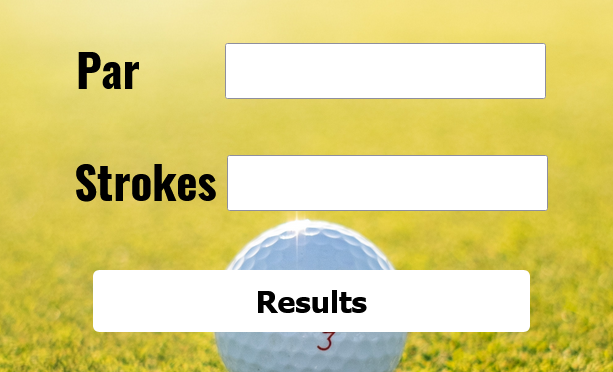

## Golf Score - FreeCodeCamp Challenge

## Table of contents

- [Overview](#overview)
  - [The challenge](#the-challenge)
  - [Screenshot](#screenshot)
  - [Links](#links)
- [My process](#my-process)
  - [Built with](#built-with)
 
- [Author](#author)

## Overview

### The challenge

Users should be able to:

- Enter Par and Strokes to determine results

### Screenshot

### Links

- Solution URL: [https://github.com/snellc1/Golf-Score](https://github.com/snellc1/Golf-Score)
- Live Site URL: [https://snellc1.github.io/Golf-Score/](https://snellc1.github.io/Golf-Score/)

## My process

### Built with

- Semantic HTML5 markup
- CSS custom properties
- Mobile-first workflow
- JavaScript
- jQuery

## Author

- Website - [Christopher Snell](https://snellc1.github.io/chrissnell/)

